# Архитектурный документ: Battle City - Текущее состояние

## Общая информация

**Проект:** Battle City (Танковая битва)  
**Движок:** Bevy 0.17  
**Язык:** Rust (Edition 2021)  
**Архитектурный подход:** Entity Component System (ECS)  
**Дата документа:** 2024

## Описание проекта

Battle City - это ремейк классической игры "Танковая битва" (Battle City), реализованный на игровом движке Bevy. Игра поддерживает одиночный и локальный мультиплеер режимы, систему уровней, физику столкновений и AI противников.

### Основные возможности

- ✅ Редактирование уровней через LDTK
- ✅ Загрузка и переключение уровней
- ✅ Система спавна игроков и врагов
- ✅ Физический движок для коллизий (Rapier2D)
- ✅ Анимации (игроки, враги, взрывы, вода, щиты)
- ✅ Игровой UI
- ✅ Звуковые эффекты
- ✅ Пауза игры
- ✅ AI врагов
- ✅ Локальный мультиплеер (2 игрока)
- ✅ WASM поддержка

## Архитектура проекта

### Структура модулей

Проект организован в виде модульной структуры с четким разделением ответственности:

```
src/
├── main.rs          # Точка входа, регистрация систем и состояний
├── common.rs        # Общие типы, константы, ресурсы
├── player.rs        # Логика игрока
├── enemy.rs         # Логика врагов и AI
├── bullet.rs        # Логика пуль и взрывов
├── level.rs         # Управление уровнями и картой
├── ui.rs            # Пользовательский интерфейс
└── area.rs          # Границы игровой области
```

### Диаграмма зависимостей модулей

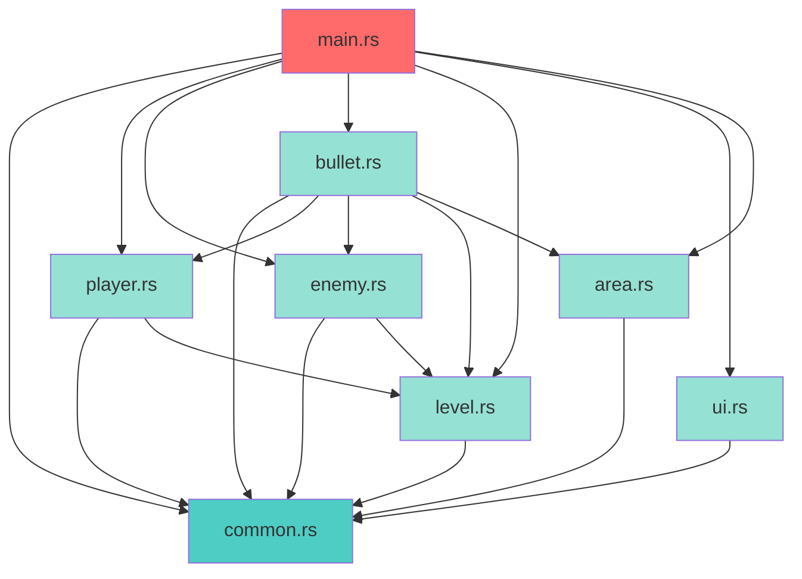

**Легенда:**
- 🔴 **main.rs** - точка входа, регистрация всех систем
- 🔵 **common.rs** - общие типы и ресурсы, используется всеми модулями
- 🟢 **Остальные модули** - специализированные модули с зависимостями

### Принципы архитектуры

1. **ECS подход (Entity Component System)**
   - Использование компонентов Bevy для данных
   - Системы для логики
   - Ресурсы для глобального состояния

2. **Разделение ответственности**
   - Каждый модуль отвечает за свою область
   - Минимальная связанность между модулями

3. **Event-driven архитектура**
   - Использование событий Bevy для коммуникации между системами
   - `ExplosionEvent`, `SpawnPlayerEvent`, `HomeDyingEvent`

### ECS Архитектура

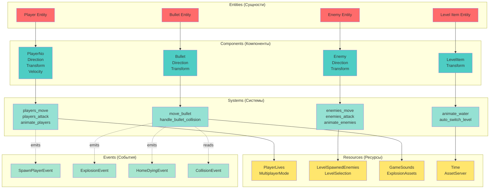

**Описание:**
- **Entities** - игровые объекты (танки, пули, элементы уровня)
- **Components** - данные, прикрепленные к сущностям
- **Systems** - логика, обрабатывающая компоненты
- **Resources** - глобальное состояние игры
- **Events** - асинхронная коммуникация между системами

## Основные компоненты

### Структура компонентов игровых сущностей

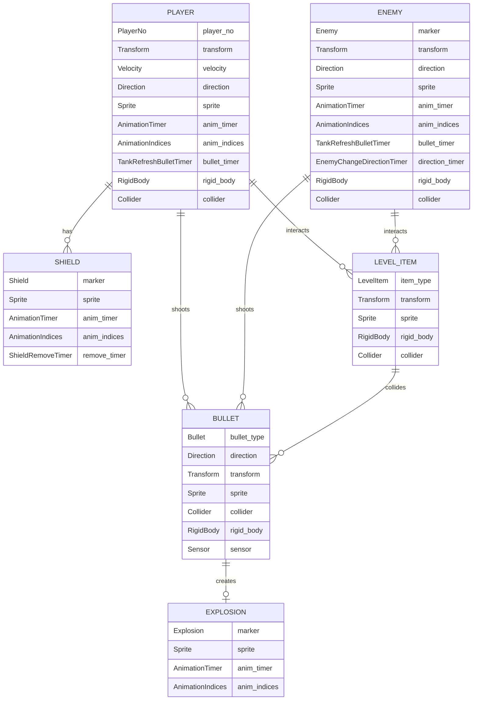

### 1. Common (`common.rs`)

**Константы:**
- `LEVEL_ROWS: i32 = 18` - количество строк в уровне
- `LEVEL_COLUMNS: i32 = 27` - количество столбцов
- `TILE_SIZE: f32 = 32.0` - размер тайла
- `MAX_LEVELS: i32 = 2` - максимальное количество уровней
- `MAX_LIVE_ENEMIES: i32 = 5` - максимальное количество врагов одновременно
- `ENEMIES_PER_LEVEL: i32 = 12` - врагов на уровень
- `PLAYER_SPEED: f32 = 150.0` - скорость игрока
- `ENEMY_SPEED: f32 = 100.0` - скорость врага

**Состояния приложения (`AppState`):**
```rust
pub enum AppState {
    StartMenu,    // Главное меню
    Playing,      // Игровой процесс
    Paused,       // Пауза
    GameOver,     // Конец игры
}
```

**Режимы игры (`MultiplayerMode`):**
```rust
pub enum MultiplayerMode {
    SinglePlayer,  // Одиночная игра
    TwoPlayers,    // Два игрока
}
```

**Направление (`Direction`):**
```rust
pub enum Direction {
    Left, Right, Up, Down,
}
```

**Компоненты:**
- `AnimationTimer` - таймер для анимаций
- `AnimationIndices` - индексы кадров анимации
- `TankRefreshBulletTimer` - таймер перезарядки выстрела

**Ресурсы:**
- `GameSounds` - звуковые эффекты игры
- `ScheduledDespawn` - дедупликация запросов на удаление сущностей
- `PlayerLives` - жизни игроков

### 2. Player (`player.rs`)

**Компоненты:**
- `PlayerNo(u32)` - номер игрока (1 или 2)
- `Shield` - щит защиты при спавне
- `ShieldRemoveTimer` - таймер удаления щита
- `Born` - эффект появления
- `BornRemoveTimer` - таймер удаления эффекта появления

**События:**
- `SpawnPlayerEvent` - событие спавна игрока

**Ресурсы:**
- `PlayerLives` - жизни игроков (player1, player2)

**Основные системы:**
- `auto_spawn_players` - автоматический спавн игроков
- `players_move` - управление движением (WASD для P1, стрелки для P2)
- `players_attack` - стрельба (Space для P1, Enter для P2)
- `animate_players` - анимация движения танков
- `animate_shield` - анимация щита
- `remove_shield` - удаление щита после таймера
- `animate_born` - анимация появления
- `spawn_born` - создание эффекта появления

**Особенности:**
- Поддержка двух игроков с разными управлениями
- Система жизней
- Защитный щит на 5 секунд после спавна
- Анимация появления перед спавном танка

#### Диаграмма компонентов Player

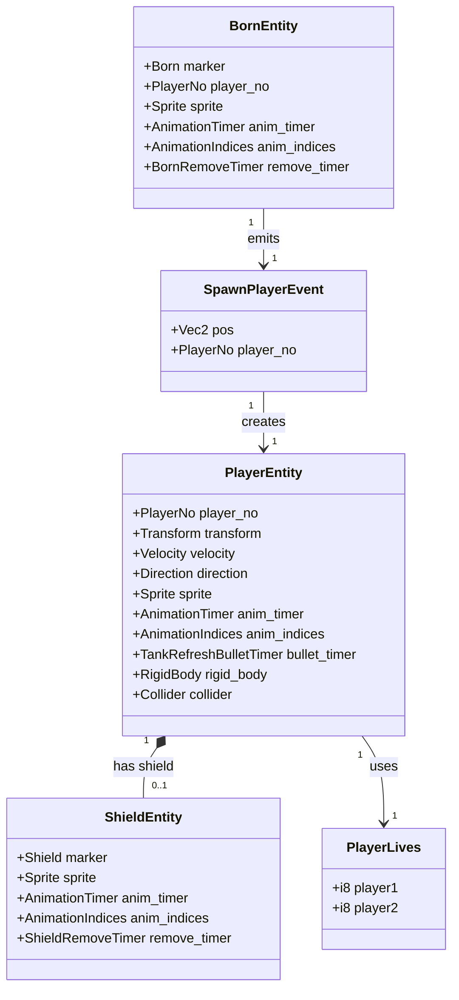

### 3. Enemy (`enemy.rs`)

**Компоненты:**
- `Enemy` - маркер врага
- `EnemyChangeDirectionTimer` - таймер смены направления

**Ресурсы:**
- `LevelSpawnedEnemies` - количество заспавненных врагов на уровне

**Основные системы:**
- `auto_spawn_enemies` - автоматический спавн врагов
- `spawn_enemy` - создание врага
- `enemies_move` - AI движение врагов
- `enemies_attack` - автоматическая стрельба врагов
- `handle_enemy_collision` - обработка коллизий врагов
- `animate_enemies` - анимация врагов

**AI логика:**
- Случайное движение с весами (вниз предпочтительнее)
- Проверка препятствий перед движением
- Смена направления при коллизии
- Автоматическая стрельба с интервалом

**Особенности:**
- Максимум 5 врагов одновременно на поле
- Спавн на случайных позициях из маркеров
- Проверка расстояния от других танков при спавне
- 8 различных визуальных типов врагов

### 4. Bullet (`bullet.rs`)

**Компоненты:**
- `Bullet` (enum) - тип пули (Player/Enemy)
- `Explosion` - маркер взрыва

**События:**
- `ExplosionEvent` - событие взрыва с типом (BigExplosion/BulletExplosion)

**Ресурсы:**
- `ExplosionAssets` - ресурсы для анимаций взрывов

**Основные системы:**
- `spawn_bullet` - создание пули
- `move_bullet` - движение пули
- `handle_bullet_collision` - обработка коллизий пуль
- `spawn_explosion` - создание взрыва
- `animate_explosion` - анимация взрыва

**Логика коллизий:**
- Пули игрока уничтожают врагов и каменные стены
- Пули врагов уничтожают игроков (если нет щита)
- Пули не проходят через железные стены
- Пули уничтожаются при попадании в границы карты
- Попадание в дом вызывает Game Over

**Особенности:**
- Разные типы взрывов (большой/маленький)
- Звуковые эффекты для взрывов
- Анимации взрывов с разным количеством кадров

#### Диаграмма обработки коллизий пуль

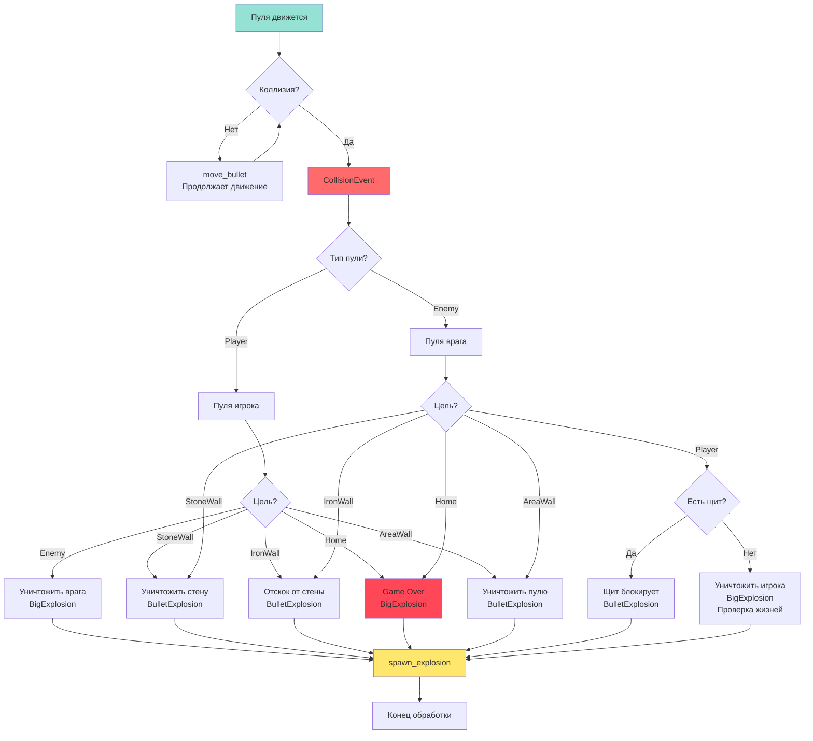

### 5. Level (`level.rs`)

**Компоненты:**
- `LevelItem` (enum) - элементы уровня:
  - `StoneWall` - каменная стена (разрушаемая)
  - `IronWall` - железная стена (неразрушаемая)
  - `Tree` - дерево (декоративное)
  - `Water` - вода (с анимацией)
  - `Home` - база (цель защиты)
- `Player1Marker` - маркер позиции игрока 1
- `Player2Marker` - маркер позиции игрока 2
- `EnemiesMarker` - маркер позиции врагов

**Bundles для LDTK:**
- `StoneWallBundle`
- `IronWallBundle`
- `TreeBundle`
- `WaterBundle`
- `HomeBundle`
- `Player1MarkerBundle`
- `Player2MarkerBundle`
- `EnemiesMarkerBundle`

**Основные системы:**
- `setup_levels` - загрузка LDTK проекта
- `spawn_ldtk_entity` - спавн сущностей из LDTK
- `animate_water` - анимация воды
- `auto_switch_level` - автоматическое переключение уровней
- `animate_home` - анимация разрушения базы

**Особенности:**
- Интеграция с LDTK для редактирования уровней
- Автоматическое создание коллайдеров для элементов
- Анимация воды
- Переключение между уровнями при уничтожении всех врагов

### 6. UI (`ui.rs`)

**Компоненты:**
- `OnStartMenuScreen` - маркер главного меню
- `OnStartMenuScreenMultiplayerModeFlag` - флаг режима игры
- `OnGameOverScreen` - маркер экрана Game Over

**Основные системы:**
- `setup_start_menu` - создание главного меню
- `setup_game_over` - создание экрана Game Over
- `start_game` - запуск игры (Enter/Space)
- `switch_multiplayer_mode` - переключение режима (↑/↓)
- `pause_game` - пауза (Escape)
- `unpause_game` - снятие с паузы (Escape)
- `animate_game_over` - анимация Game Over экрана
- `despawn_screen` - очистка экранов

**Особенности:**
- Главное меню с выбором режима игры
- Анимированный экран Game Over
- Система паузы с защитой от двойного срабатывания

### 7. Area (`area.rs`)

**Компоненты:**
- `AreaWall` - маркер граничной стены

**Основные системы:**
- `setup_wall` - создание граничных стен игровой области

**Особенности:**
- Невидимые стены по границам уровня
- Физические коллайдеры для предотвращения выхода за границы

## Физика и коллизии

### Физический движок: Rapier2D

**Конфигурация:**
- `pixels_per_meter: 100.0`
- Гравитация отключена (`gravity = Vec2::ZERO`)

**Типы тел:**
- `RigidBody::Dynamic` - для танков и пуль
- `RigidBody::Fixed` - для стен и элементов уровня

**Коллайдеры:**
- Танки: `Collider::ball()` - круглые коллайдеры
- Пули: `Collider::cuboid(2.0, 2.0)` - маленькие квадратные
- Стены: `Collider::cuboid()` - прямоугольные
- Пули используют `Sensor` для обнаружения коллизий без физического взаимодействия

**События коллизий:**
- `CollisionEvent::Started` - начало коллизии
- `CollisionEvent::Stopped` - конец коллизии
- Используется `ActiveEvents::COLLISION_EVENTS` для получения событий

### Диаграмма физических объектов

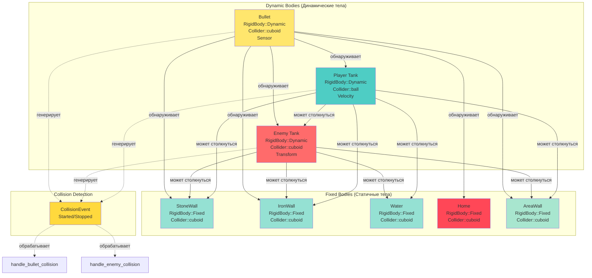

## Управление состоянием

### State Machine

Игра использует систему состояний Bevy (`AppState`):

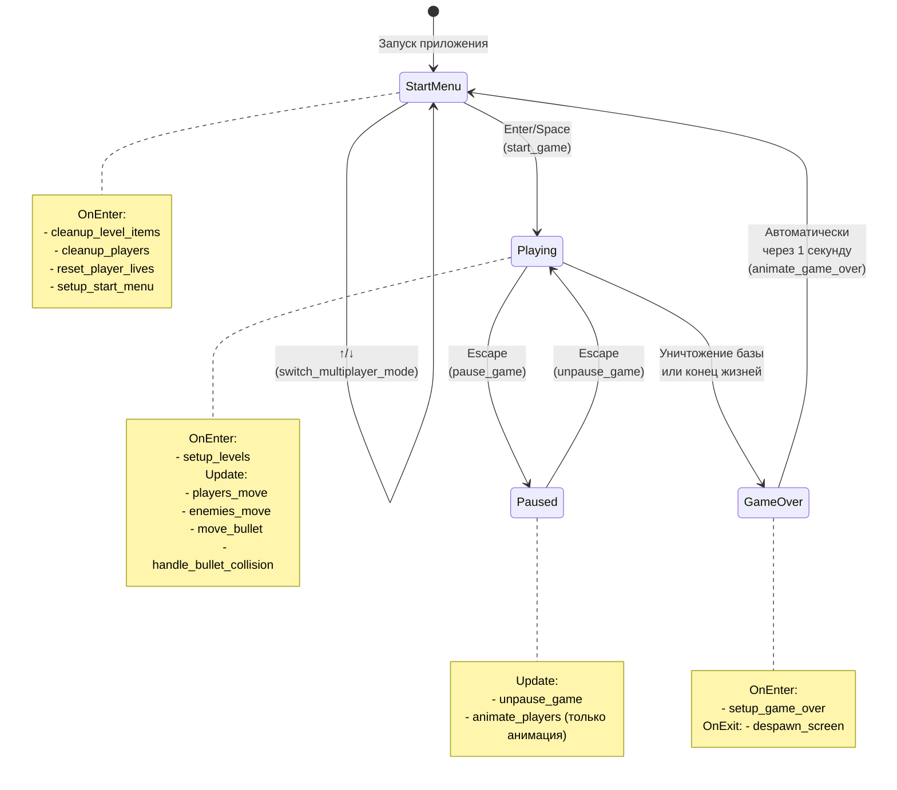

**Переходы:**
- `StartMenu → Playing`: Enter/Space в главном меню
- `Playing → Paused`: Escape
- `Paused → Playing`: Escape
- `Playing → GameOver`: Уничтожение базы или конец жизней
- `GameOver → StartMenu`: Автоматически через 1 секунду

### Ресурсы состояния

- `LevelSelection` - текущий выбранный уровень
- `LevelSpawnedEnemies` - количество заспавненных врагов
- `PlayerLives` - жизни игроков
- `MultiplayerMode` - режим игры

## Системы жизненного цикла

### Startup системы
- `setup_camera` - настройка камеры
- `setup_rapier` - настройка физики
- `setup_wall` - создание границ
- `setup_explosion_assets` - загрузка ресурсов взрывов
- `setup_game_sounds` - загрузка звуков

### OnEnter системы
- `OnEnter(AppState::StartMenu)`: очистка и сброс состояния
- `OnEnter(AppState::Playing)`: загрузка уровня
- `OnEnter(AppState::GameOver)`: показ экрана Game Over

### OnExit системы
- `OnExit(AppState::StartMenu)`: удаление UI меню
- `OnExit(AppState::GameOver)`: удаление UI Game Over

### Update системы
Системы обновления организованы по состояниям с использованием `run_if(in_state(AppState::...))`.

#### Диаграмма игрового цикла (Playing State)

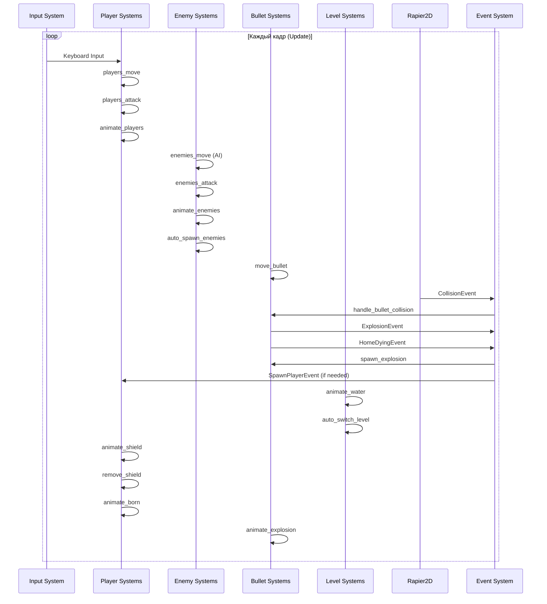

#### Диаграмма жизненного цикла сущностей

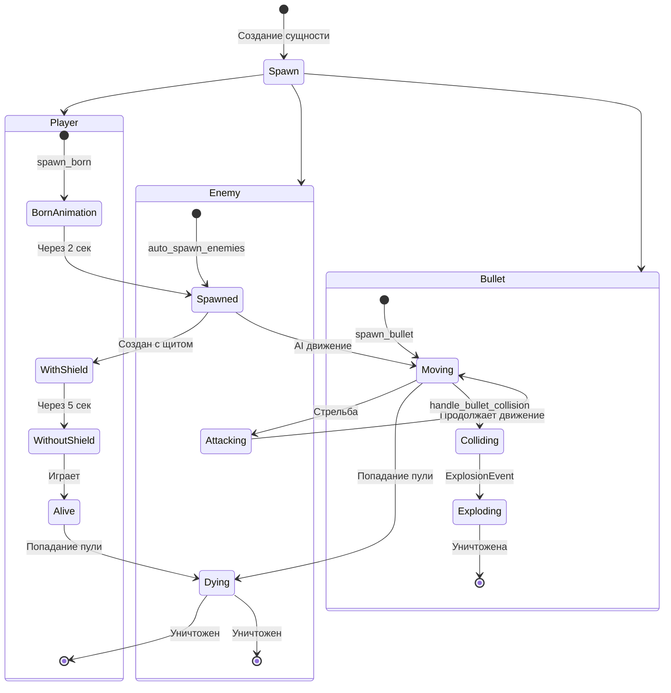

## Зависимости

### Основные зависимости

```toml
bevy = "0.17"                    # Игровой движок
bevy_rapier2d = { git = "..." }  # Физический движок
bevy_ecs_ldtk = "0.13"           # Интеграция с LDTK
rand = "0.8.5"                   # Генерация случайных чисел
```

### Особенности зависимостей

- **bevy_rapier2d**: Используется форк с поддержкой Bevy 0.17
- **bevy_ecs_ldtk**: Для загрузки уровней из LDTK файлов
- **rand**: Для AI врагов и случайного спавна

## Анимации

### Система анимаций

Все анимации используют общий паттерн:
- `AnimationTimer` - таймер обновления кадров
- `AnimationIndices` - диапазон кадров анимации
- `TextureAtlas` - спрайт-лист с кадрами

### Анимированные объекты

1. **Танки (игроки и враги)**
   - 2 кадра на направление
   - Обновление каждые 0.2 секунды

2. **Щит**
   - 2 кадра
   - Обновление каждые 0.2 секунды

3. **Вода**
   - 2 кадра (индексы 3-4)
   - Обновление каждые 0.2 секунды

4. **Взрывы**
   - Большой взрыв: 5 кадров, 0.05 сек на кадр
   - Маленький взрыв: 3 кадра, 0.05 сек на кадр

5. **Появление**
   - 4 кадра
   - Длительность 2 секунды

## Звуковая система

### Звуковые эффекты

Ресурс `GameSounds` содержит:
- `mode_switch` - переключение режима
- `bullet_explosion` - взрыв пули
- `big_explosion` - большой взрыв
- `player_fire` - выстрел игрока
- `game_over` - конец игры
- `game_pause` - пауза

### Воспроизведение

Звуки воспроизводятся через `AudioPlayer` с `PlaybackSettings::DESPAWN` для автоматического удаления после проигрывания.

## Управление памятью

### ScheduledDespawn

Ресурс `ScheduledDespawn` используется для предотвращения множественного удаления одной сущности в одном кадре. Это важно при обработке событий коллизий, которые могут срабатывать несколько раз.

### Cleanup системы

Каждое состояние имеет системы очистки:
- `cleanup_players`
- `cleanup_enemies`
- `cleanup_bullets`
- `cleanup_explosions`
- `cleanup_level_items`
- `cleanup_ldtk_world`
- `cleanup_born`

## Известные проблемы и TODO

Из кода видно следующие TODO:

1. **TODO в main.rs:**
   - "Танк при столкновении вынужден двигаться" - Танки при столкновении вынуждены двигаться

2. **TODO в enemy.rs:**
   - "Активная атака после обнаружения игрока" - Враги должны активно атаковать при обнаружении игрока
   - "Деревья могут обеспечивать укрытие" - Деревья должны обеспечивать укрытие

3. **TODO в level.rs:**
   - "Игровая победа" - Реализация экрана победы

## Рекомендации по улучшению архитектуры

### 1. Разделение на слои (Clean Architecture)

**Текущее состояние:** Логика смешана с представлением

**Рекомендации:**
- Выделить Domain слой (бизнес-логика)
- Выделить Application слой (оркестрация систем)
- Выделить Infrastructure слой (Bevy, Rapier, LDTK)

### 2. CQRS подход

**Текущее состояние:** Команды и запросы не разделены

**Рекомендации:**
- Разделить системы на Commands (изменение состояния) и Queries (чтение)
- Использовать события для коммуникации между слоями

### 3. DDD подход

**Текущее состояние:** Нет явных агрегатов и доменных моделей

**Рекомендации:**
- Выделить агрегаты: `Player`, `Enemy`, `Level`, `Bullet`
- Инкапсулировать бизнес-логику в компонентах
- Использовать Value Objects для направлений, позиций

### 4. Тестирование (TDD)

**Текущее состояние:** Нет тестов

**Рекомендации:**
- Добавить unit тесты для бизнес-логики
- Добавить integration тесты для систем
- Использовать mock для Bevy систем

### 5. Улучшение модульности

**Рекомендации:**
- Выделить общие системы анимаций в отдельный модуль
- Создать модуль для управления ресурсами
- Разделить UI на подмодули (меню, HUD, экраны)

### 6. Конфигурация

**Рекомендации:**
- Вынести константы в конфигурационные файлы
- Использовать ресурсы для настроек игры
- Поддержка загрузки конфигурации из файлов

## Общая архитектурная схема

### Диаграмма взаимодействия всех систем

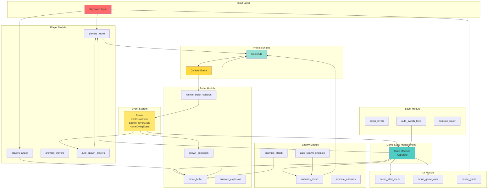

### Диаграмма потоков данных

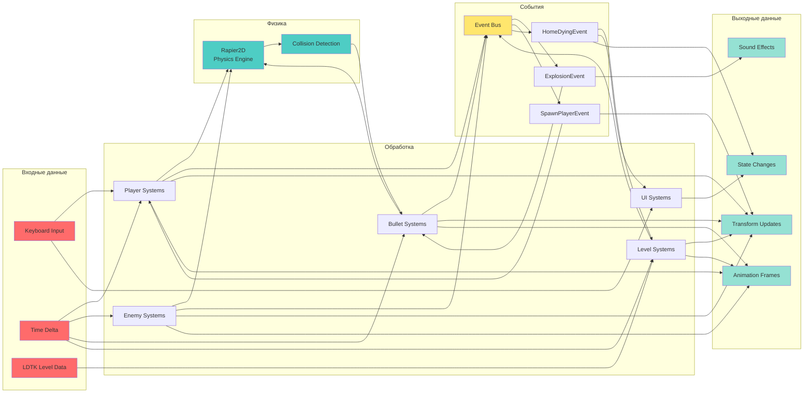

## Заключение

Проект Battle City демонстрирует хорошее понимание ECS архитектуры Bevy и правильное использование систем, компонентов и ресурсов. Код организован модульно, но есть возможности для улучшения в плане применения принципов Clean Architecture, DDD и CQRS.

Основные сильные стороны:
- ✅ Четкое разделение модулей
- ✅ Использование ECS паттернов
- ✅ Event-driven коммуникация
- ✅ Модульная структура

Области для улучшения:
- ⚠️ Применение Clean Architecture принципов
- ⚠️ Разделение на слои (Domain/Application/Infrastructure)
- ⚠️ Добавление тестов
- ⚠️ Выделение бизнес-логики из систем

---

**Версия документа:** 1.1  
**Последнее обновление:** 2024  
**Добавлено:** Архитектурные диаграммы (Mermaid)

